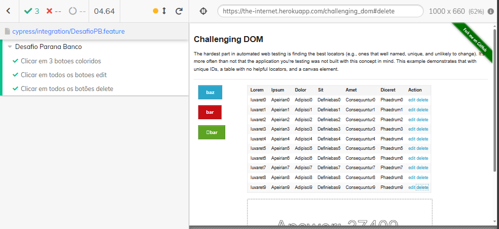

# CASE TÉCNICO | QUALITY ASSURANCE

# Estratégia e ferramentas de teste

## Resposta ao cenário proposto:

1. Análise e Planejamento:<br>
Primeiro, revisaria os requisitos do projeto em detalhes para compreender todas as funcionalidades, integrações e fluxos de trabalho envolvidos.
Identificaria os casos de uso críticos e os principais fluxos de usuário para priorizar os testes.
Criaria um plano de teste que descreve abordagens, objetivos, escopo, recursos e cronograma.

2. Abordagens de Teste:<br>
- Testes Unitários: Garantiria que cada microsserviço seja testado isoladamente, verificando a lógica de negócios e a funcionalidade interna.<br>
- Testes de Integração: Verificaria as interações entre os microsserviços, sistemas externos e bancos de dados para garantir que a comunicação seja adequada.<br>
- Testes de API: Validaria as APIs utilizadas para a comunicação entre os componentes do sistema.<br>
- Testes Funcionais: Realizaria testes de ponta a ponta para validar os fluxos de usuário completos.<br>
- Testes de Desempenho e Escalabilidade: Avaliaria o sistema sob diferentes cargas de trabalho para garantir que ele possa lidar com o alto volume de operações esperado.

3. Tipos/Níveis de Teste:<br>
- Teste de Unidade: Para garantir que cada componente individual funcione corretamente.<br>
- Teste de Integração: Para verificar as interações entre os componentes.<br>
- Teste de Sistema: Para validar todo o sistema em relação aos requisitos.<br>
- Teste de Aceitação: Para garantir que o sistema atenda aos requisitos do cliente.<br>
- Teste de Desempenho: Para avaliar o desempenho e a capacidade de escalabilidade do sistema.

4. Ferramentas:<br>
- JUnit, xUnit ou outros frameworks para testes unitários.<br>
- Postman, Insomnia ou ferramentas semelhantes para testes de API.<br>
- Selenium, Cypress ou ferramentas similares para testes funcionais.<br>
- JMeter, K6 ou ferramentas equivalentes para testes de desempenho.

5. Atuação na Equipe:<br>
Como membro da equipe, eu seria responsável por liderar a estratégia de teste, coordenando os esforços de teste em todas as fases do projeto.
Trabalharia em estreita colaboração com desenvolvedores, analistas de negócios e analistas de negócio para garantir que os requisitos sejam compreendidos e atendidos.
Realizaria revisões de código, participaria de reuniões de planejamento e relataria regularmente o progresso e os resultados dos testes à equipe. À medida que o projeto avança, a estratégia de teste pode evoluir com base nos resultados e nas mudanças nas necessidades do projeto. É fundamental manter uma abordagem flexível e adaptável para garantir o sucesso do projeto.


# Automação de testes
## Primeira parte - Automação de testes funcionais
Projeto de automação de testes funcionais na interface [The Internet](https://the-internet.herokuapp.com/challenging_dom) para os seguintes requisitos:<br>
Efetuar um clique em todos os 3 botões apresentados em tela; <br>
Clicar em todos os botões edit e delete da grid apresentada.

Esses testes foram desenvolvidos em JS com [Cypress](https://www.cypress.io/) e [Cucumber](https://cucumber.io/)

## Arquitetura do Projeto

- Cypress: Pasta Raiz do projeto
  - Integration:
    - Arquivos .feature com os cenários de testes
    - Steps: Passo-a-passo dos testes de acordo com as features
  - Support:
    - Elements: Elementos da página
    - Pages: Implementações das funções de cada feature

## Pré-Requisitos
Para a execução dos teste é necessário instalar as ferramentas abaixo:
- Node > Ultima versão LTS - [instalação Node](https://nodejs.org/en/download/)
- Cypress > versão 9.7.0
```bash
npm install cypress@9.7.0
```
- Cucumber > Ultima versão 
```bash
npm install cypress-cucumber-preprocessor
```
Após instalação do cucumber, é necessário configurar o cypress para aceitar os arquivos .feature como padrão. <br>
Adicione ao arquivo <code>cypress/plugins/index.js</code>:
```bash
const cucumber = require('cypress-cucumber-preprocessor').default

module.exports = (on, config) => {
  on('file:preprocessor', cucumber())
}
```
Por fim, adicione no arquivo <code>cypress.json</code>:
```bash
{
  "testFiles": "**/*.feature"
}
```
## Execução dos testes
Para realizar a execução dos testes, basta roda o comando abaixo:
```
npx cypress run
```
Os resultados serão apresentados no terminal ao fim da execução e um vídeo será disponibilidado para maiores detalhes.
## Resultados


## Observações
O ideal para identificação dos elementos da página seria utilização de ids de testes, porém não haviam no site fornecido.

## Segunda Parte - Automação de testes de API
Projeto de testes de API desenvolvidos na ferramenta Postman para validar os 4 verbos HTTP (GET, POST, PUT, DELETE) da api disponibilizada no end-point [JsonPlaceHolder](https://jsonplaceholder.typicode.com/users)

## Pré-Requisitos
Para a execução dos teste é necessário instalar o [Postman](https://www.postman.com/downloads/) na versão mais recente.

## Execução dos testes
Para realizar a execução dos testes, basta importar a collection e environment disponiveis na pasta <code>Teste de API - Postman</code> desse mesmo projeto.

## Resultados
Os resultados dos testes podem ser observados a cada execução dentro da ferramenta.