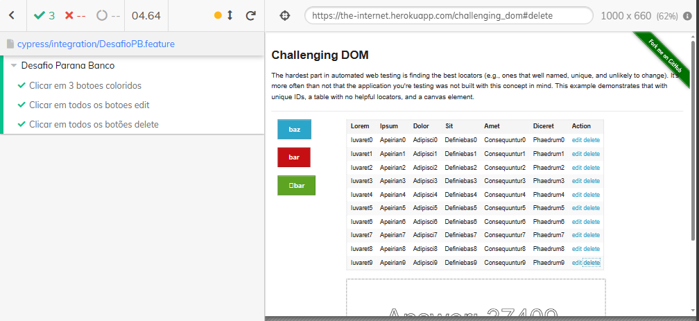

# CASE TÉCNICO | QUALITY ASSURANCE

Projeto de automação de testes funcionais na interface [The Internet](https://the-internet.herokuapp.com/challenging_dom) para os seguintes requisitos:
Efetuar um clique em todos os 3 botões apresentados em tela; <br>
Clicar em todos os botões edit e delete da grid apresentada.

Esses testes foram desenvolvidos em JS com [Cypress](https://www.cypress.io/) e [Cucumber](https://cucumber.io/)

## Arquitetura do Projeto

- Cypress: Pasta Raiz do projeto
  - Integration:
    - Arquivos .feature com os cenários de testes
    - Steps: Passo-a-passo dos testes de acordo com as features
  - Support:
    - Elements: Elementos da página
    - Pages: Implementações das funções de cada feature

## Pré-Requisitos
Para a execução dos teste é necessário instalar as ferramentas abaixo:
- Node > Ultima versão LTS - [instalação Node](https://nodejs.org/en/download/)
- Cypress > versão 9.7.0
```bash
npm install cypress@9.7.0
```
- Cucumber > Ultima versão 
```bash
npm install cypress-cucumber-preprocessor
```
Após instalação do cucumber, é necessário configurar o cypress para aceitar os arquivos .feature como padrão. <br>
Adicione ao arquivo <code>cypress/plugins/index.js</code>:
```bash
const cucumber = require('cypress-cucumber-preprocessor').default

module.exports = (on, config) => {
  on('file:preprocessor', cucumber())
}
```
Por fim, adicione no arquivo <code>cypress.json</code>:
```bash
{
  "testFiles": "**/*.feature"
}
```
## Execução dos testes
Para realizar a execução dos testes, basta roda o comando abaixo:
```
npx cypress run
```
Os resultados serão apresentados no terminal ao fim da execução e um vídeo será disponibilidado para maiores detalhes.
## Resultados
